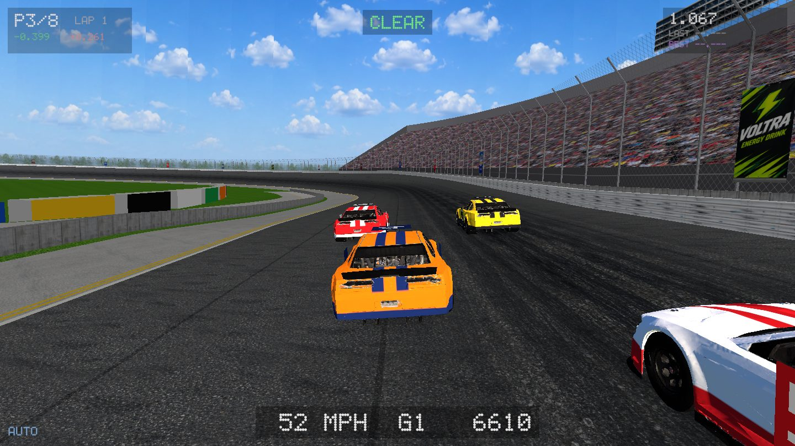
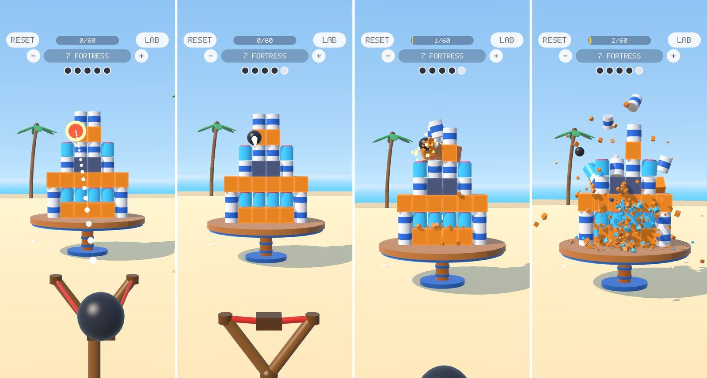

<div align="center">

# simcraft

**A deterministic game engine with its own physics, on the desktop and on your phone.**<br>
Games are data files, checked before they run, replayed bit for bit, measured step by step, and built with AI.

[](LICENSE)
[](https://www.rust-lang.org)
[](skills/)

[Getting started](#getting-started) · [Games](#games) · [Features](#features) · [Architecture](#architecture) · [Docs](docs/architecture.md) · [Contributing](CONTRIBUTING.md) · [Türkçe](README.tr.md)

</div>

<p align="center">
  
</p>

## Why simcraft

- **Deterministic.** Integer maths, a fixed timestep, no shared randomness: same seed and inputs, same world on
  every machine. Runs replay bit for bit. (One deliberate exception: the 3D rigid-body solver is `f32` until its
  first game's feel is locked; it sits outside the rules engine.)
- **Data first.** A game is a `game.ron` and an `engine.toml`; a car, a track or a mobile level is a file too.
- **Checked before it runs.** Every error is listed at load, with where it is and how to fix it.
- **Measured.** Physics against closed-form answers, performance against saved baselines, feel with probes, every
  change as a saved eval step.
- **Desktop to phone.** The phone app is built once and plays games as data: a change is on your iPhone in under a
  minute.

## Getting started

```bash
git clone https://github.com/cemphlvn/simcraft && cd simcraft
cargo build --release -p sim-gpu -p sim-agent
target/release/simcraft-play games/race      # drive
tools/check.sh --quick                       # fmt, clippy, tests, every game checked
tools/mobile/build.sh ios phone              # SMASH on your iPhone over Wi-Fi (also: ios sim, android apk)
```

Make a new game with your AI: `skills/install.sh`, then *"make a game where …"*. Any game also talks JSON over
stdin (`{"cmd":"step","n":10}`), for scripts, tests and agents.

## Games

### `games/race`: stock cars on a banked oval (desktop)

Eight cars on Charlotte's 1.5-mile, 24°-banked quad-oval; seven drive themselves. Each car is a spec sheet
([`stock_car.ron`](assets/vehicles/stock_car.ron)), the track a file of straights and banked turns
([`charlotte.ron`](games/race/tracks/charlotte.ron)); nothing in the engine knows it is a race. Its autopilot laps in
30.75 s against a real pole of 29.355 s ([log](games/race/LAPS.md)).

### `games/smash`: a slingshot against a tower (phone)

<p align="center">
  
</p>

Pull to aim, let go, knock the tower off its pedestal. Eight levels, each a few rows of data in
[`smash.ron`](games/smash/smash.ron) (`ccccc / cccc / ccc` is a can pyramid). Tuned eval-driven, every step in
[`EVALS.md`](games/smash/EVALS.md):

| A player felt | Before → after |
|---|---|
| "Part of the tower can't be hit" | reachable: 64 → 100 % |
| "The shot moves when I let go" | release roll: 4.3 → 0 cm |
| The camera lurches | jerk: 16,540 → 635 m/s³ |
| On an iPhone 14 Pro | 120 fps through every collapse |

## Features

- **Physics** (`sim-physics`): fixed-point numerics; vehicle dynamics with tyres, drivetrain, ABS and traction
  control; 3D rigid bodies that stack, sleep and topple (Box2D v3 soft step, SAT, speculative contacts); tracks as
  data; a racing AI.
- **Simulation** (`sim-core`, `sim-state`, `sim-rules`): grid and voxel worlds with continuous motion, state charts,
  rules as data (native plus [Rhai](https://rhai.rs)), snapshots and replays.
- **Rendering** (`sim-gpu`, `sim-render`): wgpu views (stage, track, voxel, cockpit), cameras, input and audio as
  data, a terminal renderer.
- **Mobile** (`sim-mobile`): one shell for iPhone and Android, touch gestures, haptics, tilt, safe-area layers,
  3D with shadows.
- **Tooling:** a JSON protocol and a C API for Unity and Unreal, evals (`tools/eval.py`, `simcraft-smash eval`),
  benchmarks with hash checks, headless screenshots, [AI agent skills](skills/).

## Architecture

| Crate | What it does |
|---|---|
| `sim-physics` | Numerics, vehicles, rigid bodies, contact, tracks (depends on nothing else) |
| `sim-core` | The world, the tick loop, effects, hashing, snapshots |
| `sim-state` / `sim-rules` | State charts / loading, compiling and checking a game |
| `sim-agent` / `sim-ffi` | The JSON protocol / the C API for host engines |
| `sim-gpu` / `sim-render` | `simcraft-play` and the GPU views / the terminal renderer |
| `sim-mobile` | The phone: shell, touch, haptics, 3D, the player and SMASH |
| `kernel`, `test` | ONNX graphs for learning agents; scenarios, golden hashes, property tests |

None of them knows a particular game. The single source of truth is [`docs/architecture.md`](docs/architecture.md);
how each feature grew out of a game is in [`docs/emergence.md`](docs/emergence.md).

## Performance

| Apple Silicon, release | |
|---|---|
| Vehicle physics, 8 sub-steps | ~150 ns per car per tick |
| `games/traffic`, 1,600 cars | 2.72 ms per tick, from 257 ms ([PERF.md](games/traffic/PERF.md)) |
| SMASH on an iPhone 14 Pro | ≤ 4.4 ms of work per 8.3 ms frame |

## Status

Young: breaking changes will come before 1.0, but golden hashes make sure they never silently change an existing
game. Runs on macOS, iOS and Android (Linux and Windows planned); the Unity and Unreal adapters are written but not
yet compiled in their editors. See [`CONTRIBUTING.md`](CONTRIBUTING.md) to help.

MIT licensed, see [LICENSE](LICENSE).
