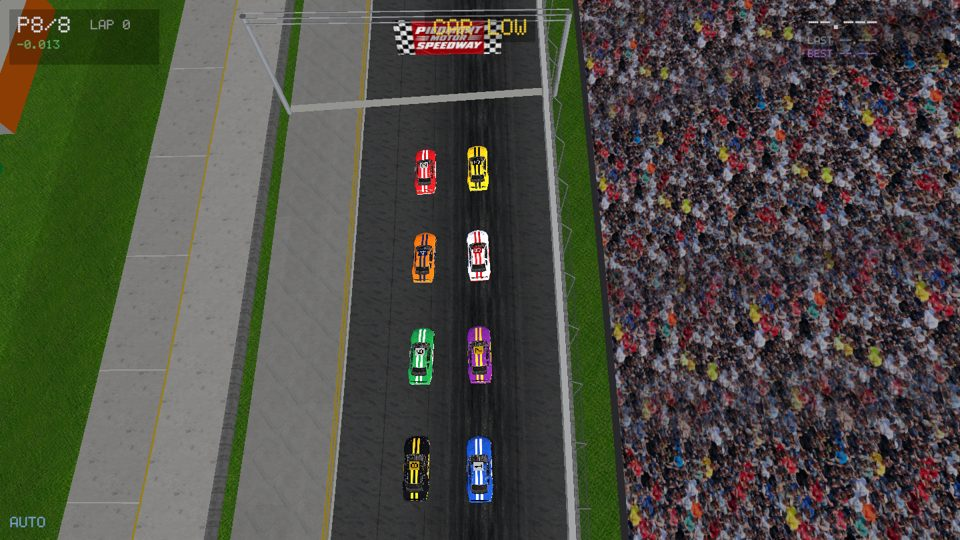
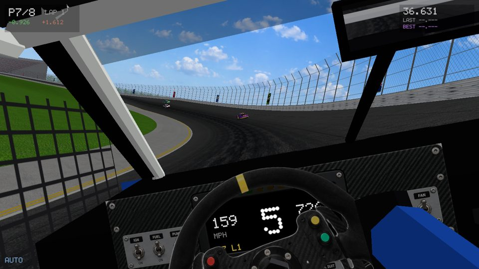
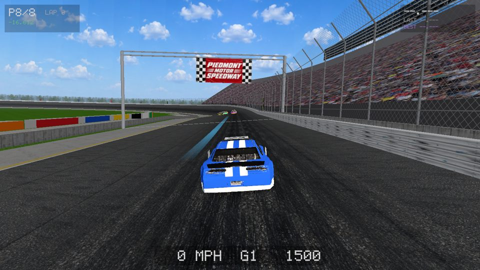
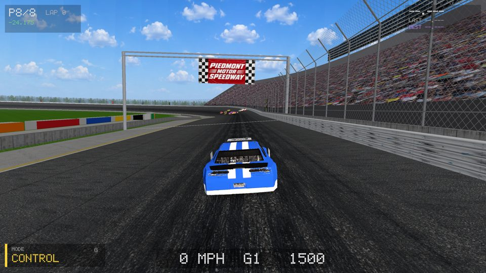
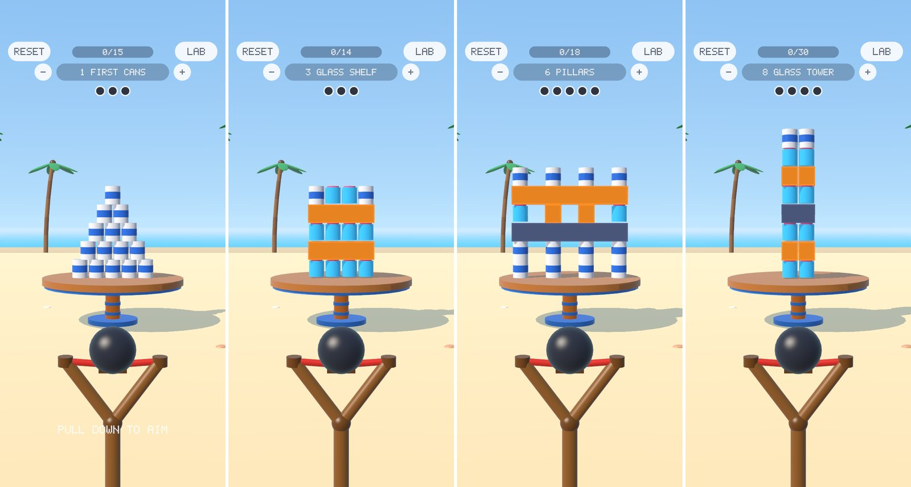

<div align="center">

# simcraft

**A deterministic simulation and game engine with its own physics engine, on the desktop and on your phone.**<br>
Games are readable data files, checked before they run, replayed bit for bit, measured step by step, and built with AI.

[](LICENSE)
[](https://www.rust-lang.org)
[](skills/)

[Getting started](#getting-started) · [Features](#features) · [Games](#featured-games) · [Mobile](#mobile-sim-mobile) · [Architecture](#architecture) · [Who it is for](#who-it-is-for) · [Docs](docs/architecture.md) · [Contributing](CONTRIBUTING.md) · [Türkçe](README.tr.md)

</div>

<p align="center">
  
</p>
<sub><code>games/race</code>: stock cars on a 1.5-mile banked oval. Every car is data, stepped by simcraft's own vehicle
physics at 480 Hz; seven drive themselves, you drive the eighth.</sub>

## Design considerations

- **Deterministic simulation.** Integer arithmetic end to end (no floats in the simulation), a fixed timestep, no
  shared randomness, no hash-map iteration order. Same seed and inputs, same world, on every machine and core
  count: runs replay bit for bit and every experiment is evidence. (One exception, on purpose: the new 3D
  rigid-body solver runs in `f32` while its first game's feel is being tuned, deterministic on the same binary; it
  moves to fixed point once the feel is locked. It sits outside the rules engine, so rule games are unaffected.)
- **Data first.** A game is a `game.ron` (kinds, state machines, rules, actions) and an `engine.toml` (seed,
  population, parameters). A car is a vehicle file, a track a track file. Designers change numbers, not code.
- **Checked before it runs.** Every expression is compiled and dry-run at load; every error is listed at once, with
  the rule, state or field it belongs to, in words a person or an AI can fix.
- **Measured, not assumed.** Physics is tested against closed-form answers, performance against saved baselines
  with the world's hash compared at every step, game feel with a probe of what the camera actually drew.
- **One game, desktop to phone.** The same core runs in a window, headless in tests, and in a phone app built once:
  a game is data the player loads, so trying a change on a real phone takes under a minute.
- **Physics behind a narrow boundary.** `sim-physics` knows nothing about games or the world: plain data in, a
  fixed step, plain data out. The same split Unity, Unreal and Godot make with their physics libraries.

## Features

### Physics (`sim-physics`)

- **Numerics:** Q48.16 fixed point with 128-bit intermediates, exact integer square root, binary angles (2³² per
  turn), sine and cosine from a table built at compile time with integer maths, `atan2` by CORDIC.
- **Vehicle dynamics:**
  - a dynamic bicycle model with slip-angle tyres (linear to the limit, then sliding);
  - a friction circle shared by drive, brakes and cornering;
  - load transfer, downforce and banking;
  - a kinematic model at walking pace.
- **Drivetrain:**
  - an engine torque curve read from dyno points;
  - a slipping clutch, a rev limiter and engine braking;
  - a sequential gearbox, automatic at the optimal shift points or manual;
  - a reverse gear.
- **Driver aids:** traction control and ABS.
- **Time stepping:** 60 Hz ticks with 8 sub-steps each (480 Hz), semi-implicit Euler.
- **Collision:**
  - a sweep-and-prune broad phase;
  - a separating axis test between oriented boxes as the narrow phase, with an averaged contact manifold;
  - sequential impulses with accumulated clamping, restitution and Coulomb friction;
  - walls from the track's edges.
- **Rigid bodies (3D):** boxes, upright prisms (cans, jars) and spheres that stack, rest, topple and get hit:
  - Box2D v3's soft step in 6 substeps, warm starting, relax and restitution passes, Coulomb friction, rolling
    resistance;
  - a separating axis test on convex hulls with face clipping (up to 4 contact points);
  - speculative contacts, so a fast projectile cannot tunnel, kept only when the sweep really reaches (no ghost
    collisions);
  - islands that fall asleep together: a tower spawned asleep stays bit-identical until it is hit;
  - collision layers (debris that hits the ground but not the tower), impacts for breaking, haptics and camera, a
    ray cast and an exact sphere cast.
- **Tracks as data:** straights, circular arcs and clothoid-eased turns (transition spirals) with banking.
  `pose(s, offset)` and `locate(x, y)` answer where things are.
- **Driver AI:**
  - a quasi-steady-state lap plan;
  - pure-pursuit steering with understeer-gradient feed-forward;
  - racecraft (passing and following at a speed-dependent gap);
  - spin recovery.

### Mobile (`sim-mobile`)

- **One shell for iPhone and Android:** winit and wgpu (Metal, Vulkan), surfaces dropped and rebuilt with the app's
  lifecycle, a loop that waits for the display instead of spinning (94 % → 2–3 % CPU on a still screen).
- **A player built once:** the app plays simcraft games as data (bundled `game.ron` levels, or a game's tuning
  file), so publishing a game never compiles the engine.
- **Touch:** taps, drags, swipes, pull-and-release, and swipe-across (a finger crossing a shape, for ropes).
- **Haptics as a vocabulary:** tap, thud, tick, rise, fall and buzz with intensity and sharpness; Core Haptics on
  iOS.
- **Sensors:** tilt from Core Motion, in whole numbers, so replays include it.
- **Screen layers:** backdrop, board, pieces, effects, HUD and overlay, anchored to the safe area (notches, islands,
  home bars).
- **3D on the phone:** instanced meshes with a sun shadow map, hemisphere light, a toy-look chamfer on every box
  edge, fog and 4× MSAA, under the 2D layers.
- **Build and run:** `tools/mobile/build.sh ios phone` installs on your iPhone over Wi-Fi; the simulator, an App Store
  archive, an Android APK and a Play bundle are one command each.

### Simulation (`sim-core`, `sim-state`, `sim-rules`)

- **World:** a grid world (2D or voxels) with continuous motion on top: sub-cell positions and velocities, gravity,
  mounts that carry riders, footprint queries (`ahead`, `behind`, `touching`, `under`), and vehicles.
- **Behaviour:** state charts with nesting, parallel layers, reusable machines, remember, interrupt/back and pick
  (the vocabulary of Unity's Animator and Unreal's StateTree).
- **Rules:** rules as data, compiled once. A native evaluator runs the common subset (closure compilation), and
  [Rhai](https://rhai.rs) scripts handle the rest.
- **Queries:** a sweep-and-prune index for moving kinds, and bounded nearest-neighbour search.
- **State:** snapshots and restore, a replay log, and a message bus to observe a run live.

### Rendering and play (`sim-gpu`, `sim-render`)

- **GPU renderer** (wgpu):
  - a 2.5D stage view;
  - a first-person track view;
  - a first-person voxel view;
  - the drive view, with cockpit, chase and top-down cameras, a live mirror, glTF models in instanced liveries, and
    photographed materials.
- **Camera feel as data:** a spring-damped head that leans with g-forces, speed-scaled effects and hitstop.
- **Input as data:** analog keyboard axes with rise and fall times, speed-sensitive steering, and cycling buttons.
- **Audio:** a mixer with buses. Engine loops are crossfaded by RPM, other cars get distance attenuation and the
  Doppler effect, and a spotter calls on the radio.
- **Terminal renderer:** ASCII and pixel art, for headless machines and quick looks.

### Tooling

- **Agent protocol:** the same JSON-lines protocol for humans, scripts and AI agents; a C API (`sim-ffi`) for hosts.
- **Measurement:** eval-driven development (`tools/eval.py` for rule games, `simcraft-smash eval` for SMASH), scaling
  benchmarks with a world-hash check (`tools/perf.py`), physics benchmark scenes (`simcraft-physics-bench`), and a
  feel probe (`--feel`).
- **Pictures without a window:** `simcraft-play --shot` and `simcraft-smash shot` render frames headless, so a
  camera change can be looked at, and compared, from a script.
- **AI agent skills:** your AI writes the game, runs the checks and reports what happened
  ([`skills/`](skills/)).

## Featured games

### `games/race`: stock cars on a banked oval (desktop)

A stock-car race on a 1.5-mile quad-oval with Charlotte Motor Speedway's published length, turn radii, turn
lengths and 24° banking (the shape of the dogleg is approximate). You start from the back of an 8-car field.

```bash
cargo build --release -p sim-gpu && target/release/simcraft-play games/race
```

| Key | |
|---|---|
| ↑ ↓ ← → | throttle, brake, steering (analog ramps from the keyboard) |
| **G** or the MODE button | **CONTROL** (you steer; traction control and ABS) → **GUIDED** (you choose your line; the car follows it and keeps you within its grip) → **AUTOPILOT** |
| C · A / Z · Backspace | camera (cockpit, chase, top-down) · shift up / down · reverse |
| Tab · M · R | ride on board another car · mute · restart |

#### How it's made

Nothing in the engine knows this is a race. Each thing on screen comes from a few lines of data, and the engine
supplies the general machinery: physics, tracks, cameras, input. Here is what produced each picture.

<table>
<tr>
<td width="44%"></td>
<td>

**Eight cars through a banked turn.** Each car is a spec sheet in a file,
[`assets/vehicles/stock_car.ron`](assets/vehicles/stock_car.ron): mass, wheelbase, a torque curve as dyno points,
gear ratios, brakes, tyre grip, drag and downforce. The game only says which kind of thing is a car:
`vehicle: "stock_car"`. The physics engine turns those numbers into speed, grip, slides and gear changes, so a
truck or a hatchback is a different file, not different code.

</td>
</tr>
<tr>
<td></td>
<td>

**The grid.** The track is a file of straights and turns with their banking,
[`games/race/tracks/charlotte.ron`](games/race/tracks/charlotte.ron), generated from the speedway's published
figures. One rule in [`game.ron`](games/race/game.ron) runs on the first tick: every car gets a grid slot, a pace
and a line, and seven get the engine's autopilot. The paint schemes are a list in
[`drive.ron`](games/race/drive.ron) that tints one 3D model.

</td>
</tr>
<tr>
<td></td>
<td>

**From the seat.** The cockpit is a description in `drive.ron`: where the driver's eye is, how stiff the neck
springs are, where the mirror sits. The physics engine reports the g-forces the driver feels, and the head leans
against them; the dash shows the engine's rpm and gear. The same camera works for any game with cars.

</td>
</tr>
<tr>
<td></td>
<td>

**GUIDED: you pick the line.** The three play modes are one number on your car (who drives: you, you plus the
autopilot, or the autopilot). A rule moves your line when you press left or right, and the engine's autopilot
steers along it. The faint line on the road and the MODE button are two lines in `drive.ron` that show that
number.

</td>
</tr>
<tr>
<td></td>
<td>

**Start/finish.** The banner, the crowd, the SAFER barrier and the asphalt are pictures named in `drive.ron`. The
laps and lap times shown are two short rules in `game.ron`: crossing the line counts a lap, and the rule remembers
the best one.

</td>
</tr>
</table>

| Measured | Result |
|---|---|
| Autopilot lap in the Next Gen car | **30.75 s**, against a real 2024 pole of **29.355 s** ([every step in the log](games/race/LAPS.md)) |
| Physics against closed-form answers | turning circle, understeer gradient, skidpad limit μ·g, a banked turn held by the slope alone, braking distance, top speed, gear shifts |
| Collision property test | 2,000 random car-to-car hits conserve momentum and never create energy |

The assets are generated (Higgsfield), and all brands are fictional. The engine sound and music are CC0 recordings
you add ([list](assets/src/race/audio/README.md)); until then the engine note is synthesised.

### `games/smash`: a slingshot against a tower (phone)

A casual stack-and-topple game for portrait phones, in Smash Fest's family. Pull the slingshot down to aim, let go,
and knock the tower off its pedestal: cans scatter, wood and stone topple, glass jars shatter. Eight levels, a few
stones each, stars for stones left over.

<p align="center">
  
</p>
<sub>One shot on the FORTRESS level: the dotted arc lands exactly where the stone first touches, then hit-stop,
debris and the collapse. Rendered without a window by <code>simcraft-smash shot</code>.</sub>

```bash
tools/mobile/build.sh ios phone        # build, install and launch on your paired iPhone over Wi-Fi
cargo run --release -p sim-mobile --bin simcraft-mobile              # or a phone-sized window on the desktop
```

#### How it's made

- **The levels are data.** [`games/smash/smash.ron`](games/smash/smash.ron) holds every number that shapes the
  feel (stone speed, pull distance, hit-stop, shake, camera) and the levels as rows of pieces from the bottom:
  `ccccc / cccc / ccc` is a can pyramid, `=` and `#` are wood and stone beams. A new level is a few lines.

  

- **The physics engine does the rest.** The tower is spawned asleep, so it stands perfectly still until the first
  hit; then every piece is a rigid body. Glass breaks when a hit changes its speed past its threshold, into shards
  that only touch the ground.
- **The aim is direct.** The pull picks a height on the tower, evenly from base to top, and sideways picks a point
  across it; the launch angle is solved. A release shoots the aim from 80 ms before the finger lifted.
- **The camera has depth.** Aiming, and tilting the phone, slide the camera while it keeps looking at the tower:
  the tower holds still under your finger and the beach glides past behind it.
- **Feedback marks the big moments:** hit-stop, slow motion on a big collapse, trauma-based shake, debris, haptics.

#### Measured, step by step

SMASH is tuned eval-driven: `simcraft-smash eval` plays scripted shots through the same calls a finger makes, on
fresh towers, and compares every change with the step before. Every step, including the worse ones and the
rejected guesses, is in [`games/smash/EVALS.md`](games/smash/EVALS.md).

| What a player felt | Measured before → after |
|---|---|
| "I can't see what I'm pulling" | pouch on screen while aiming: 0 → 100 % of the time |
| "Part of the tower can't be hit" | share of the tower a finger can reach: 64 → 100 %; the hit climbs evenly (16.8× → 1.13× uneven) |
| "The shot moves when I let go" | finger roll on release: 4.3 → 0 cm |
| The camera lurches | camera jerk: 16,540 → 635 m/s³ |
| The phone buzzes non-stop | haptic pulses in any one second: 27 → 9 |
| The dotted arc lies | arc vs real first touch: 0.2–0.3 m → about 6 cm (it found a solver bug: ghost collisions) |
| On an iPhone 14 Pro | 120 fps through every collapse, at most 4.4 ms of an 8.3 ms frame |

## Getting started

Needs [Rust](https://rustup.rs) (and Python 3 for the scripted players and tools).

```bash
git clone https://github.com/cemphlvn/simcraft && cd simcraft
cargo build --release -p sim-gpu -p sim-agent
target/release/simcraft-play games/race                                    # drive
echo '{"cmd":"step","n":600}' | target/release/simcraft-agent games/race   # the same race, headless
tools/check.sh --quick                                                     # fmt, clippy, tests, every game checked
```

On your phone (Xcode 26 and `xcodegen` for iOS; JDK 17, the Android SDK and NDK, `cargo-ndk` for Android):

```bash
tools/mobile/build.sh ios phone                                 # your paired iPhone, over Wi-Fi (no cable)
tools/mobile/build.sh ios sim                                   # the iOS simulator, with a screenshot
tools/mobile/build.sh android apk                               # an APK for a device or an emulator
SIMCRAFT_GAMES=games/<name> tools/mobile/build.sh ios phone     # bundle a rule game's levels into the player
```

### A game in data

```ron
// games/wolf_sheep/game.ron: a rule
(name: "predation", for: "wolf", when: "near.sheep <= 1",
 then: [ Despawn(Nearest("sheep")), Set("hunger", "0"), Emit("kill") ]),

// games/race/game.ron: a kind that is a car, on a track
kinds: { "car": (motion: (size: (1996, 4912)), vehicle: "stock_car", props: { ... }) },
track: (file: "tracks/charlotte.ron", origin: (650000, 50000), grid: (spacing: 9000, columns: 2, gap: 5000)),
```

A mobile game is data too: SMASH's levels and feel are [`games/smash/smash.ron`](games/smash/smash.ron), which the
phone player embeds; `simcraft-smash check` reads it after every edit, and `simcraft-smash eval --set
sling.max_speed=28` tries a change without touching the file.

Talk to any game over stdin, one JSON line at a time (`{"cmd":"observe"}`, `{"cmd":"act",...}`,
`{"cmd":"step","n":10}`), from a script, a test or an AI. Build a new one with your AI: `skills/install.sh`, then
*"make a game where …"*.

## Architecture

```
            game.ron   engine.toml   vehicles/*.ron   tracks/*.ron      (data: what the designer writes)
                                 │
                            sim-rules ─── compiles and checks the game, runs its rules
                                 │
      sim-state ───────── sim-core ─── world, tick loop, effects, determinism, snapshots
    (state charts)               │
                           sim-physics ─── vehicles, rigid bodies, contact, tracks, numerics (depends on nothing else)
                                 │
   sim-agent (JSON protocol) · sim-ffi (C API: Unity, Unreal) · sim-gpu / sim-render (windows, terminals)
   sim-mobile (iPhone, Android: touch, haptics, sensors, 3D, the player and SMASH)
```

| Crate | What it does | Knows the game? |
|---|---|---|
| `sim-physics` | Fixed-point numerics, vehicle dynamics and drivetrain, 3D rigid bodies, contact, tracks, the driver AI, benchmark scenes | No (not even the world) |
| `sim-core` | The world (entities, grid, per-kind index, continuous motion, vehicles), effects, the tick loop, hashing, snapshots | No |
| `sim-state` | State charts: nesting, layers, reusable machines, remember, interrupt/back, pick | No |
| `sim-rules` | Loads `game.ron` and `engine.toml`, compiles rules (native subset + Rhai), dry-runs and validates | The schema, not the content |
| `sim-agent` | `simcraft-agent`: the JSON-lines protocol, replays, observation | No |
| `sim-ffi` | The C library and header for host engines | No |
| `sim-gpu` | wgpu renderer and `simcraft-play`: stage, track, voxel and drive views, audio, feel probe; `simcraft-check` | No |
| `sim-render` | Terminal renderer and `simcraft-view` | No |
| `sim-mobile` | The phone: one shell for iOS and Android, touch, haptics, sensors, screen layers, 3D, the player, SMASH and `simcraft-smash` | No (SMASH is a card of its own) |
| `kernel` | An integer tensor machine for ONNX graphs (learning agents) | No |
| `test` (`simtest`) | Scenario files, golden hashes, snapshots, property tests | No |

The single source of truth is [`docs/architecture.md`](docs/architecture.md). How each feature grew out of a game
is in [`docs/emergence.md`](docs/emergence.md).

## Who it is for

**Game designers.** You work in `game.ron`, `engine.toml` and data files, and no Rust is needed. You describe what
the player should feel and decide; your AI writes the rules; the engine refuses anything it cannot run and says
why. Every change can be measured on fixed seeds ([`skills/simcraft-eval`](skills/simcraft-eval/SKILL.md)).
*How you improve the engine:* design games that push it. When a game hits a wall (a rule you cannot express, a feel
you cannot tune), that wall becomes the next engine feature, recorded with its evidence in
[`docs/emergence.md`](docs/emergence.md). Most features in simcraft started that way.

**Game developers.** You get a deterministic core that runs headless for tests and bots, a C API for Unity and
Unreal, a GPU player with cameras, input, audio and glTF models as data, and replays that reproduce a bug exactly.
*How you improve the engine:* build views, controls, cameras and host adapters (`sim-gpu`, `adapters/`); bring
assets; play the games and report what feels wrong, with a `--feel` probe or a replay file to show it.

**Engineers.** You get an integer physics engine small enough to read, a rules compiler, state charts, and a
measurement culture: every optimisation is a saved step with the world's hash unchanged
([`games/traffic/PERF.md`](games/traffic/PERF.md): 94× faster at 1,600 cars, step by step).
*How you improve the engine:* the physics layer's next steps are planned in
[`docs/plans/physics-and-vehicles.md`](docs/plans/physics-and-vehicles.md): suspension with sub-stepped springs,
the rigid-body solver in fixed point, joints, a structure-of-arrays state. Tests come first (`test/`, and oracle
tests in `sim-physics`), and `tools/check.sh` must stay green. See [`CONTRIBUTING.md`](CONTRIBUTING.md).

## Performance

Measured on an Apple Silicon laptop (release builds):

| | |
|---|---|
| Vehicle physics, full model with 8 sub-steps | ~150 ns per car per tick (1,000 cars: 0.15 ms) |
| `games/traffic`, 1,600 cars with rules and queries | 2.72 ms per tick (from 257 ms, [PERF.md](games/traffic/PERF.md)) |
| `games/race` drive view, 8 cars + mirror, 1440×810 | ~5 ms GPU per frame |
| Autopilot lap, simulated headless | ~13,000× faster than real time |
| SMASH on an iPhone 14 Pro | 120 fps through every collapse; at most 4.4 ms of work per 8.3 ms frame |
| Rigid bodies, a tower collapsing on the phone | ≤ 1.4 ms per tick with 57 bodies awake; ~25 µs while the tower sleeps |

## Supported platforms

- **Simulation core** (`sim-core`, `sim-state`, `sim-rules`, `sim-physics`): native and `wasm32`.
- **`simcraft-play`:** developed and tested on macOS (Metal). wgpu also targets Vulkan and DX12; Linux and Windows
  builds are planned.
- **Phones** (`sim-mobile`): iOS, played on an iPhone 14 Pro and the simulator, with an App Store archive; Android
  builds an APK and a Play bundle (16 KB pages) and runs in the emulator. Haptics on Android come next.
- **Host adapters:** the C API, the C++ wrapper and the C# `Simulation` are tested. The Unity `SimcraftWorld`
  component and the Unreal module are written, but not yet compiled in their editors.

## Status

simcraft is young, and breaking changes will happen before 1.0. Golden hashes make sure they never happen silently
to existing games. The physics engine has vehicles, contact, tracks and 3D rigid bodies that stack, sleep and topple
(in `f32` for now). It does not yet have suspension, joints, ragdolls or full continuous collision detection
(speculative contacts cover fast projectiles).

## License

MIT, see [LICENSE](LICENSE).
